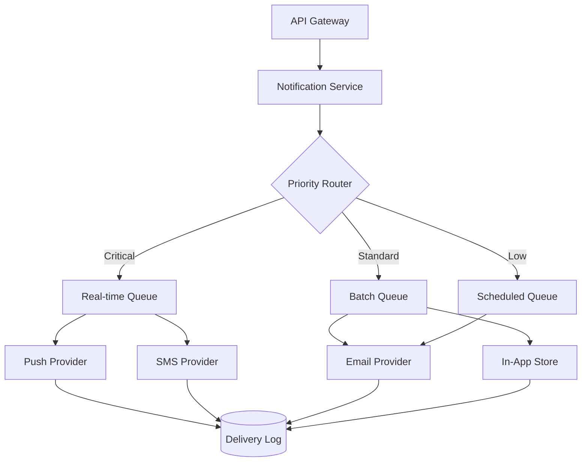

#  System Design: Real-Time Notification Service

## Overview

This document outlines the architecture for a scalable notification service handling **50M+ daily active users** across push, email, SMS, and in-app channels.

## Requirements

### Functional

- Multi-channel delivery (push, email, SMS, in-app)
- User preference management
- Template-based content rendering
- Delivery tracking and analytics
- Rate limiting per user and channel

### Non-Functional

- **Latency**: P99 < 500ms for in-app notifications
- **Throughput**: 100K notifications/second at peak
- **Availability**: 99.99% uptime
- **Durability**: No notification loss

## Architecture



## Data Model

| Entity       | Fields                                                          | Storage            |
| ------------ | --------------------------------------------------------------- | ------------------ |
| Notification | id, user_id, channel, template_id, payload, status, created_at  | PostgreSQL         |
| Preference   | user_id, channel, enabled, quiet_hours, frequency               | Redis + PostgreSQL |
| Template     | id, name, subject, body, variables, version                     | PostgreSQL         |
| Delivery Log | notification_id, channel, status, provider_response, latency_ms | TimescaleDB        |

## Rate Limiting Strategy

```python
class NotificationRateLimiter:
    def __init__(self, redis_client):
        self.redis = redis_client
        self.limits = {
            "push": {"max": 20, "window": 3600},
            "email": {"max": 5, "window": 86400},
            "sms": {"max": 3, "window": 86400},
            "in_app": {"max": 100, "window": 3600},
        }

    async def check_and_increment(self, user_id: str, channel: str) -> bool:
        key = f"rate:{user_id}:{channel}"
        limit = self.limits[channel]
        current = await self.redis.incr(key)
        if current == 1:
            await self.redis.expire(key, limit["window"])
        return current <= limit["max"]
```

## Failure Handling

1. **Retry with exponential backoff**: 1s, 2s, 4s, 8s, 16s (max 5 attempts)
2. **Dead letter queue**: Failed notifications after max retries
3. **Circuit breaker**: Per-provider, opens after 50% failure rate in 60s window
4. **Fallback channels**: Push failure -> in-app, SMS failure -> email

## Capacity Planning

| Metric                     | Value   |
| -------------------------- | ------- |

| Avg notifications/user/day | 8       |
| Peak multiplier            | 3x      |
| Messages/second (peak)     | ~140K   |
| Storage/day                | ~12 GB  |
| Monthly storage            | ~360 GB |

---

_Last updated: April 2026_
