# Mermaid Diagrams — All 19 Types

> **Tip:** Double-click any diagram to open the visual editor.

## Flowchart

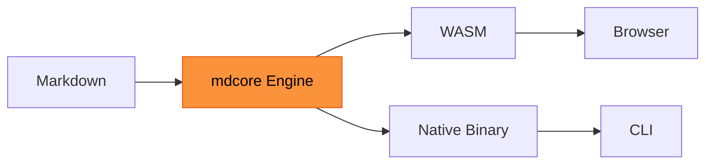

## Sequence Diagram

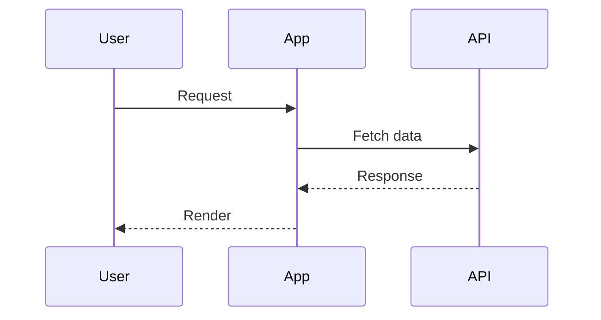

## Pie Chart

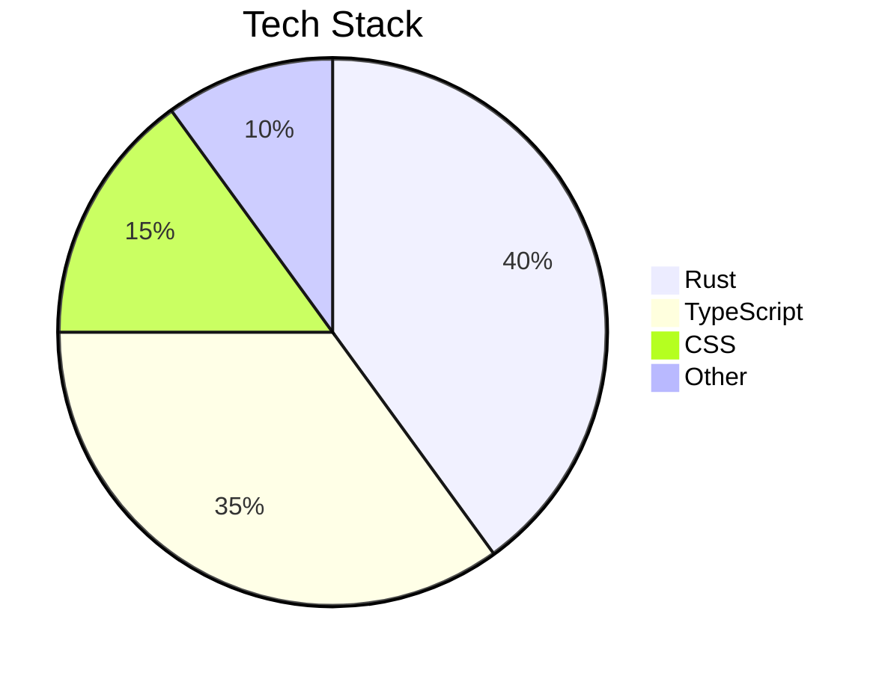

## Gantt Chart

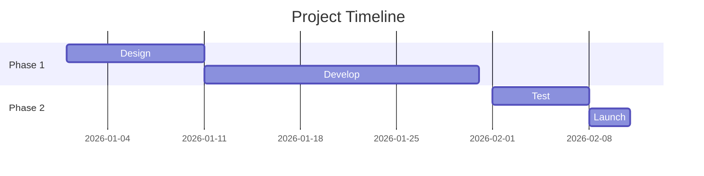

## Class Diagram

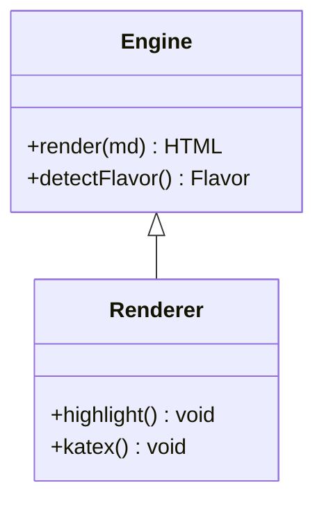

## State Diagram

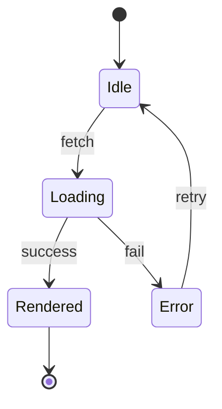

## ER Diagram

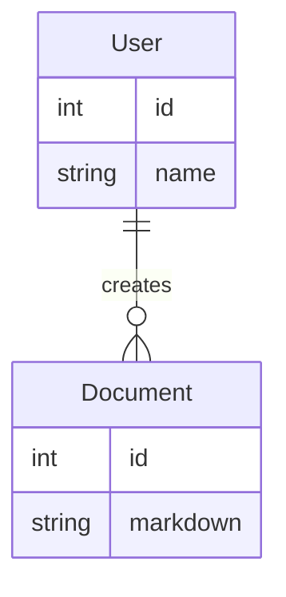

## Mindmap

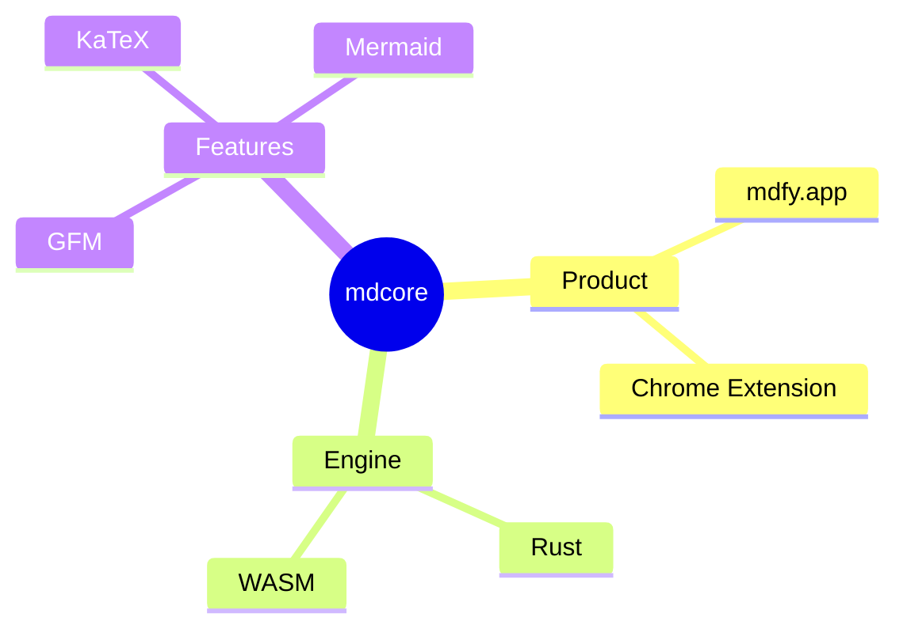

## Timeline

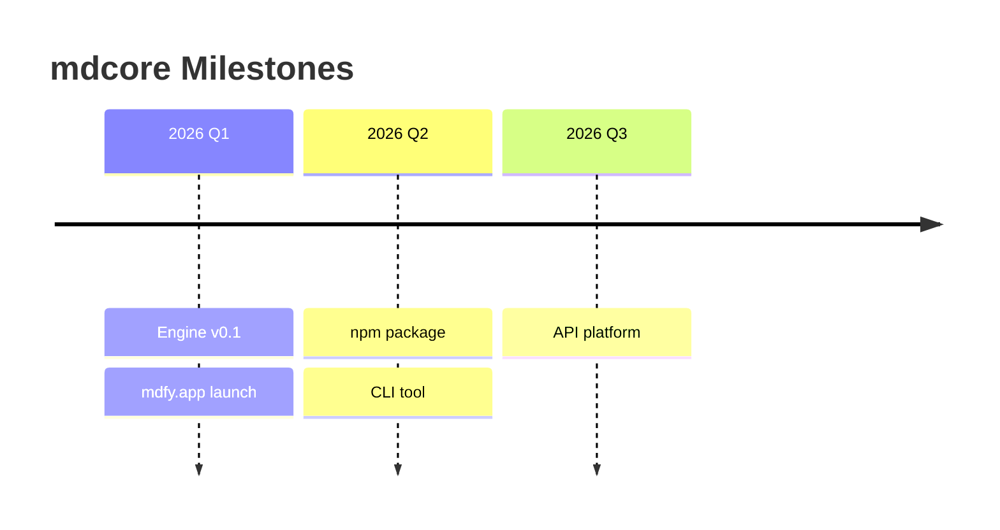

## User Journey

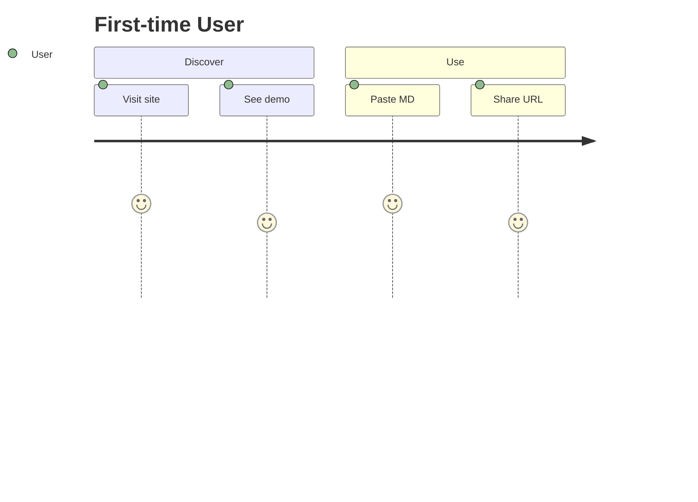

## Quadrant Chart

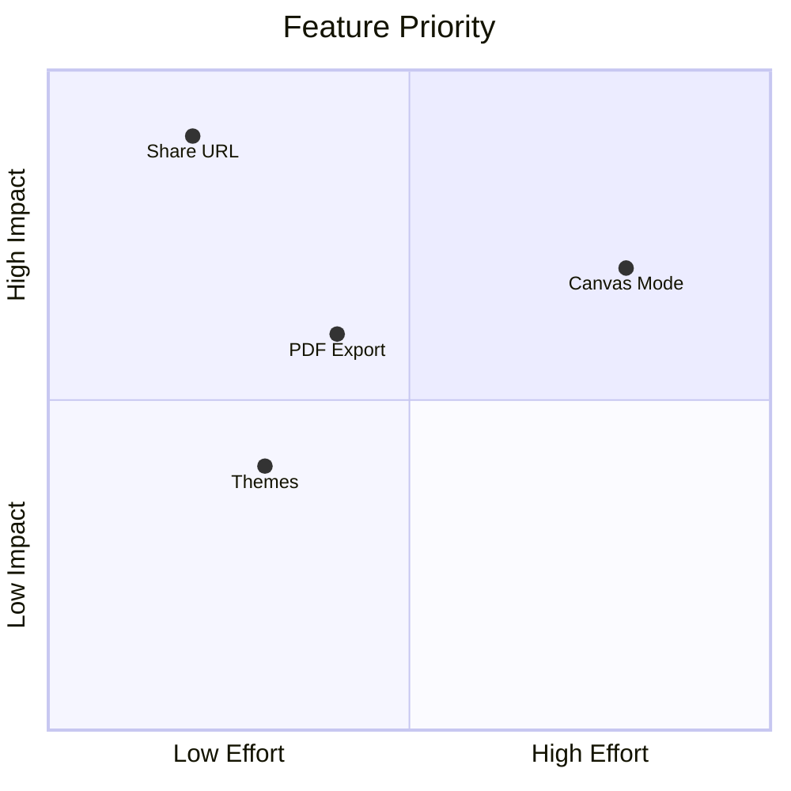

## Git Graph

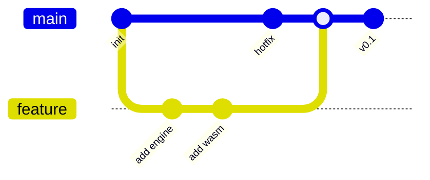

## XY Chart

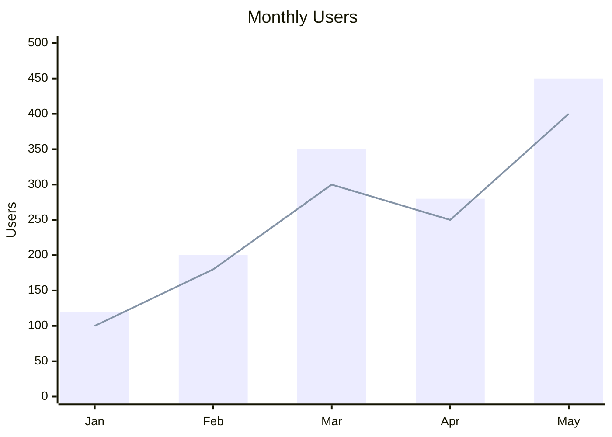

---

*All 19 Mermaid diagram types with visual editors. Double-click to edit.*
