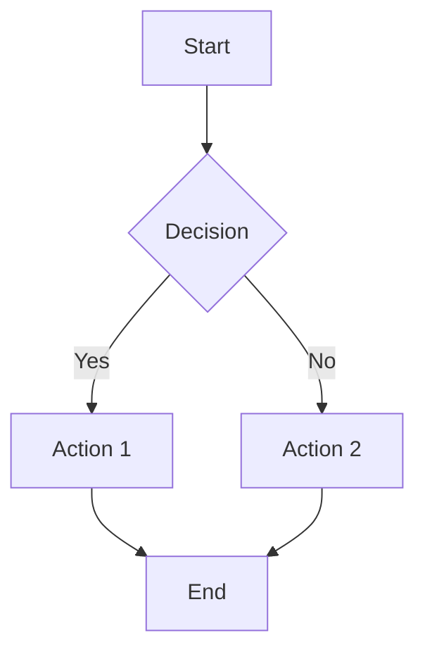
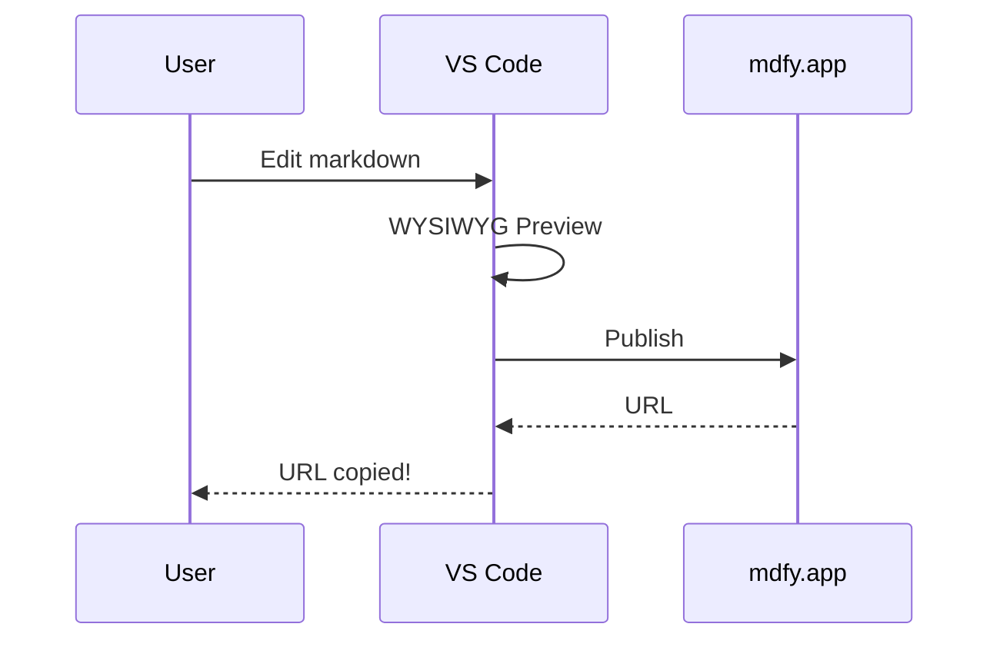
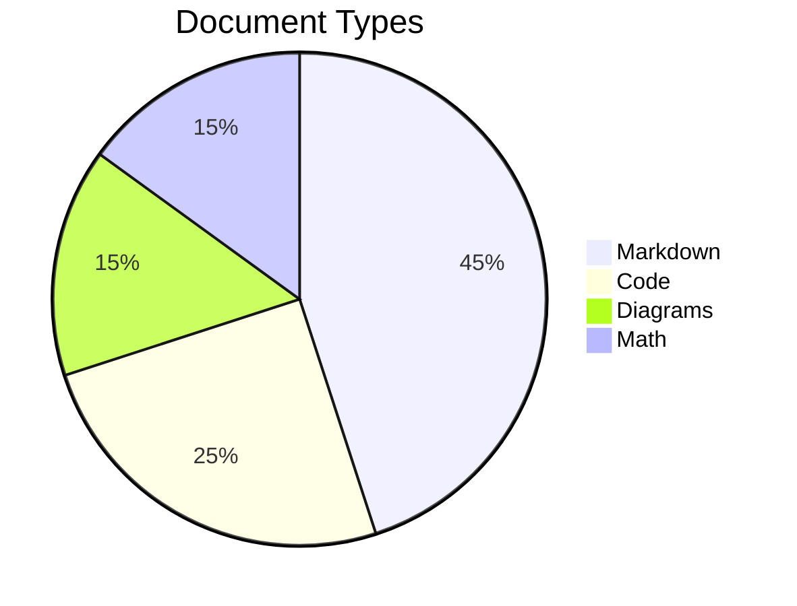

# mdfy VS Code Extension Test Document

This file contains every Markdown element to test the WYSIWYG preview.

## Text Formatting

This is **bold text**, this is *italic text*, this is ~~strikethrough~~, and this is `inline code`.

You can also combine them: ***bold italic***, **~~bold strikethrough~~**, *~~italic strikethrough~~*.

## Headings

### H3 Heading

#### H4 Heading

##### H5 Heading

###### H6 Heading

## Links and Images

Here is a [link to mdfy.app](https://mdfy.app) and another [link to GitHub](https://github.com).


## Lists

### Unordered List

- First item
- Second item
  - Nested item A
  - Nested item B
    - Deep nested
- Third item

### Ordered List

1. Step one
2. Step two
   1. Sub-step 2.1
   2. Sub-step 2.2
3. Step three

### Task List

- [x] Completed task
- [x] Another completed task
- [ ] Pending task
- [ ] Another pending task
  - [ ] Sub-task

## Blockquote

> This is a blockquote. It can contain **bold**, *italic*, and `code`.
>
> It can span multiple paragraphs.

> Nested blockquote:
>
> > This is nested inside another blockquote.

## Code Blocks

```javascript
function greet(name) {
  console.log(`Hello, ${name}!`);
  return { greeting: `Hello, ${name}!` };
}

greet("mdfy");
```

```python
def fibonacci(n):
    """Generate fibonacci sequence"""
    a, b = 0, 1
    for _ in range(n):
        yield a
        a, b = b, a + b

list(fibonacci(10))
```

```rust
fn main() {
    let message = "Hello from Rust!";
    println!("{}", message);
    
    let numbers: Vec<i32> = (1..=10).collect();
    let sum: i32 = numbers.iter().sum();
    println!("Sum: {}", sum);
}
```

```sql
SELECT u.name, COUNT(d.id) as doc_count
FROM users u
LEFT JOIN documents d ON d.user_id = u.id
WHERE u.created_at > '2024-01-01'
GROUP BY u.name
ORDER BY doc_count DESC
LIMIT 10;
```

## Tables

| Feature | Status | Notes |
| --- | --- | --- |
| WYSIWYG Preview | Done | contentEditable |
| Publish to mdfy.app | Done | One-click |
| Bidirectional Sync | Done | Push/Pull |
| Code Highlighting | Done | highlight.js |
| Math Rendering | Done | KaTeX |
| Mermaid Diagrams | Done | Dynamic render |
| Flavor Detection | Done | GFM/Obsidian/MDX |
| Export | Done | HTML/Slack/Rich Text |

### Wide Table

| Col 1 | Col 2 | Col 3 | Col 4 | Col 5 | Col 6 |
| --- | --- | --- | --- | --- | --- |
| A1 | B1 | C1 | D1 | E1 | F1 |
| A2 | B2 | C2 | D2 | E2 | F2 |
| A3 | B3 | C3 | D3 | E3 | F3 |

## Math (KaTeX)

Inline math: $E = mc^2$ and $\sum_{i=1}^{n} i = \frac{n(n+1)}{2}$

Display math:

$$
\int_{-\infty}^{\infty} e^{-x^2} dx = \sqrt{\pi}
$$

$$
\begin{bmatrix}
a & b \\
c & d
\end{bmatrix}
\begin{bmatrix}
x \\
y
\end{bmatrix}
=
\begin{bmatrix}
ax + by \\
cx + dy
\end{bmatrix}
$$

## Mermaid Diagrams





## Horizontal Rule

Content above the rule.

---

Content below the rule.

## HTML Elements

<details>
<summary>Click to expand</summary>

This is hidden content inside a details/summary block.

- It can contain lists
- And **formatted** text
- And even `code`

</details>

## Special Characters

Arrows: -> <- <-> => <= <=>

Quotes: "double" 'single'

Dash: em-dash -- en-dash

Ellipsis: ...

## Mixed Content

Here's a paragraph with **bold**, *italic*, `code`, and a [link](https://mdfy.app) all together. Following this is a code block, then a table, then a diagram:

```bash
echo "Hello, World!"
curl -s https://mdfy.app/api/docs | jq '.id'
```

| Input | Output |
| --- | --- |
| Markdown | HTML |
| Code | Highlighted |
| Math | Rendered |



---

*Published with [mdfy.app](https://mdfy.app) -- Your Markdown, Beautifully Published.*
